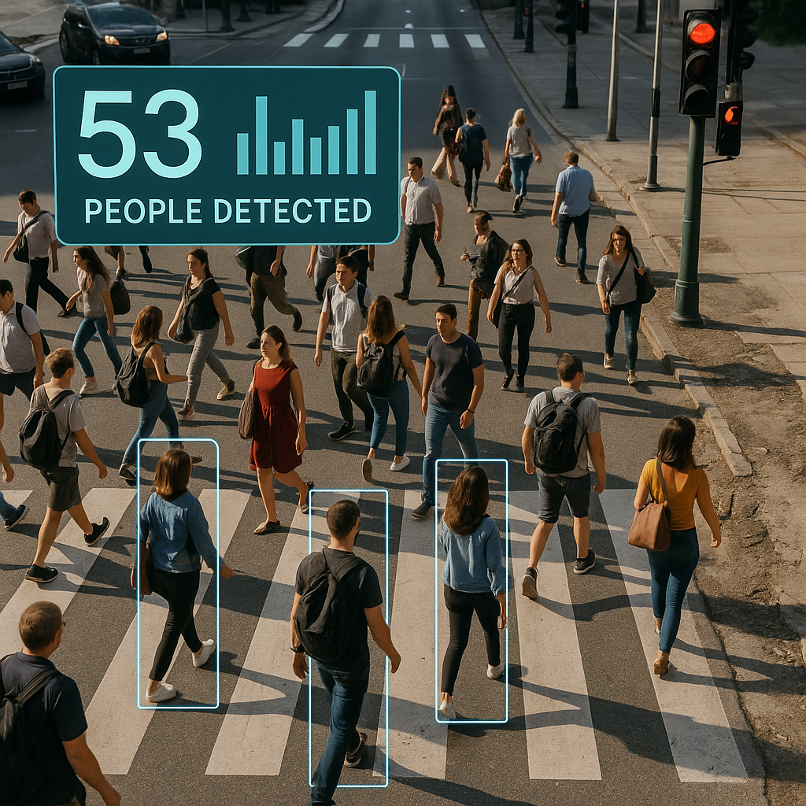

# Real-Time Pedestrian Counting with YOLO11 🚶‍♂️🚦

<div align="center">




</div>

## 🎯 Project Objective

<div style="text-align: justify">
This project implements a **real-time pedestrian detection and counting system** using the YOLO11 object detection algorithm. The main goal is to monitor and quantify pedestrian flow in urban areas by placing a virtual counting line on video footage. This tool is designed to assist in urban planning, pedestrian safety studies, and smart city applications.
</div>

---

## 🔄 Workflow Overview

1. 📹 **Video Input**  
   The script loads a video file of an urban area where pedestrian flow is to be analyzed.

2. 🖱️ **Virtual Counter Line Selection**  
   - A custom HTML tool (`Selector_puntos.html`) is provided to interactively select two points on a video frame, defining the position of the virtual counting line.
   - The selected coordinates are used in the main script to set up the counting region.

3. 🤖 **YOLO11 Model Initialization**  
   - The script loads a YOLO11 model pre-trained for pedestrian detection.
   - The model is configured to detect only the class corresponding to persons.

4. 🎯 **Real-Time Detection and Counting**  
   - For each frame in the video:
     - The YOLO11 model detects pedestrians.
     - The script checks if detected pedestrians cross the virtual counting line.
     - The count is updated in real time and can be displayed on the output video.

5. 📼 **Output Generation**  
   - The processed video, with bounding boxes, the virtual line, and the pedestrian count overlay, is saved to disk.
   - Optionally, the output can be displayed in real time.

---

## � Demo Video

[](https://www.youtube.com/watch?v=a81K_AmEOEI)

Click on the image above to watch a demonstration of the pedestrian detection and counting system in action. The video showcases the real-time detection capabilities, the virtual counting line functionality, and the accuracy of our YOLO11-based implementation.

---

## �🌟 Key Features

- **Interactive Line Selection:**  
  Use the included HTML tool to easily define the counting line on any video.

- **Accurate Pedestrian Detection:**  
  Utilizes YOLO11 for robust and efficient detection in urban environments.

- **Real-Time Counting:**  
  Counts pedestrians as they cross the virtual line, providing immediate feedback.

- **Customizable Output:**  
  Save the processed video with overlays for further analysis or reporting.

---

## 🏗️ Project Architecture
```
📦 Pedestrians_project/
├── 📂 Models/                       # Model weights directory
│   ├── yolo11l.pt                   # Large YOLO11 model weights
│   ├── yolo11m.pt                   # Medium YOLO11 model weights
│   └── yolo11s.pt                   # Small YOLO11 model weights
├── 📂 Resources/                    # Resource files directory
│   ├── 📂 videos/                   # Input videos for analysis
│   │   ├── Cruce_Estacionamiento_CU_2.mp4
│   │   └── ...
│   └── 📂 videos_output/            # Processed videos with overlays
│       ├── Cruce_Estacionamiento_CU_2.mp4
│       └── ...
├── 📂 Images/                       # Images and assets
│   ├── background_minimalista.svg   # UI background
│   ├── logo_siiia_w.png             # SIIIA logo
│   ├── UMSNH.png                    # UMSNH logo
│   ├── Home.png                     # README header image
│   └── Selector.png                 # Tool preview image
├── 📜 Real_time_object_counting.py   # Main detection script
├── 📜 Selector_puntos.html          # Web-based line selection tool
├── 📜 requirements.txt              # Python dependencies
├── 📜 LICENSE                       # MIT License file
└── 📜 README.md                     # Project documentation
```

---

## � Clone & Install

1. **Clone the Repository:**
   ```bash
   git clone https://github.com/JaGuzmanT/Pedestrians_project.git
   cd Pedestrians_project
   ```

2. **Set up Python Environment:**
   ```bash
   # Create and activate a virtual environment (recommended)
   python -m venv venv
   # On Windows
   .\venv\Scripts\activate
   # On Linux/Mac
   source venv/bin/activate
   ```

3. **Install Required Libraries:**
   ```bash
   pip install -r requirements.txt
   ```

   Main dependencies include:
   - ultralytics==8.0.196
   - opencv-python==4.8.0.76
   - numpy>=1.22.2
   - torch>=2.0.0
   - torchvision>=0.15.0

4. **Download YOLO11 Models:**
   - The models are included in the repository under the `Models/` directory
   - Available versions: yolo11s.pt (small), yolo11m.pt (medium), yolo11l.pt (large)
   - Choose the model size based on your computational resources

---

## �🚀 How to Use

1. **Configure the Script:**  
   - Set the video path and model path in the script.
   - Input the selected region points for the counting line.

2. **Run the Script:**  
   - Execute the script in your Python environment.
   
3. **Select the Counting Line:**  
   - The `Selector_puntos.html` will be open in your browser. Select the two points for the virtual line and write the coordinates in the terminal, where the input values will be entered.
   - The script will process the video, detect pedestrians, and count them as they cross the line.

4. **Review the Output:**  
   The output video will be saved in the specified folder, showing detections, the counting line, and the running count.

---

## 📚 Citation

If you use this tool in your research, please cite:

> Guzmán Torres, J.A., Universidad Michoacana de San Nicolás de Hidalgo, Faculty of Civil Engineering, AULA-CIMNE, Morelia, Michoacán, México.

---

## 🙏 Acknowledgements

This project was developed as part of research on urban mobility and smart city solutions. Special thanks to the open-source community and contributors to the YOLO and Ultralytics projects.

---

## :abacus: Methodology & Algorithms

### :books: Machine Learning Pipeline

1. **Video Input Processing**: 
   - High-quality video capture from urban environments
   - Frame extraction and preprocessing for optimal detection
   - Interactive line placement through web interface

2. **YOLO11 Detection Pipeline**:
   - Real-time frame processing using YOLO11 architecture
   - Person class filtering for focused pedestrian detection
   - Bounding box generation with confidence scores

3. **Counting Algorithm**:
   - Virtual line intersection detection
   - Direction-aware pedestrian tracking
   - Real-time count accumulation and display

4. **Output Generation**:
   - Overlay visualization of detection boxes
   - Dynamic count display and statistics
   - Processed video export with annotations

### :trophy: Why YOLO11 for Pedestrian Detection?

| Feature         | Traditional Methods    | YOLO11 Detection    |
|-----------------|-----------------------|---------------------|
| **Speed**       | Slow frame processing | Real-time detection |
| **Accuracy**    | Variable reliability  | High precision      |
| **Scalability** | Limited by hardware   | GPU-accelerated     |
| **Flexibility** | Fixed viewing angles  | Adaptable placement |
| **Automation**  | Manual counting       | Automated tracking  |
---
## :scientist: Research Team

### :man_scientist: Principal Researchers

<table>
<tr>
<td width="33%">

**Dr. José Alberto Guzmán Torres** :mexico:
- :office: [SIIIA MATH: Soluciones en ingeniería](http://www.siiia.com.mx)
- :classical_building: [Universidad Michoacana de San Nicolás de Hidalgo](http://www.umich.mx)
- :microscope: Engineering applications & Artificial Intelligence
- :email: jose.alberto.guzman@umich.mx
- :globe_with_meridians: [ORCID](https://orcid.org/0000-0002-9309-9390)

</td>
<td width="33%">

**Dr. Francisco Javier Domínguez Mota** :mexico:
- :office: [SIIIA MATH: Soluciones en ingeniería](http://www.siiia.com.mx)
- :classical_building: [Universidad Michoacana de San Nicolás de Hidalgo](http://www.umich.mx)
- :microscope: Applied Mathematics & Finite Difference Methods
- :email: francisco.mota@umich.mx
- :globe_with_meridians: [ORCID](https://orcid.org/0000-0001-6837-172X)

</td>
<td width="33%">

**Dr. Gerardo Tinoco Guerrero** :mexico:
- :office: [SIIIA MATH: Soluciones en ingeniería](http://www.siiia.com.mx)
- :classical_building: [Universidad Michoacana de San Nicolás de Hidalgo](http://www.umich.mx)
- :microscope: Numerical Methods & Computational Mathematics
- :email: gerardo.tinoco@umich.mx
- :globe_with_meridians: [ORCID](https://orcid.org/0000-0003-3119-770X)

</td>
</tr>
</table>
---

## :books: Scientific References

### :books: Core Publications

1. **Guzmán-Torres, J. A.**, Domínguez-Mota, F. J., Tinoco-Guerrero, G., Tinoco-Ruíz, J. G., & Alonso-Guzmán, E. M. (2024). *Extreme fine-tuning and explainable AI model for non-destructive prediction of concrete compressive strength, the case of ConcreteXAI dataset.* **Advances in Engineering Software**, 192, 103630. [DOI: 10.1016/j.advengsoft.2024.103630](https://doi.org/10.1016/j.advengsoft.2024.103630)

2. Guzmán-Torres, J. A., Domínguez-Mota, F. J., Alonso-Guzmán, E. M., Tinoco-Guerrero, G., & Martínez-Molina, W. (2024). ConcreteXAI: A multivariate dataset for concrete strength prediction via deep-learning-based methods. Data in Brief, 53, 110218. [DOI: 10.1016/j.dib.2024.110218](https://doi.org/10.1016/j.dib.2024.110218)

---

## :bookmark_tabs: License

MIT License

Copyright (c) 2025 José A. Guzmán-Torres

Permission is hereby granted, free of charge, to any person obtaining a copy
of this software and associated documentation files (the "Software"), to deal
in the Software without restriction, including without limitation the rights
to use, copy, modify, merge, publish, distribute, sublicense, and/or sell
copies of the Software, and to permit persons to whom the Software is
furnished to do so, subject to the following conditions:

The above copyright notice and this permission notice shall be included in all
copies or substantial portions of the Software.

THE SOFTWARE IS PROVIDED "AS IS", WITHOUT WARRANTY OF ANY KIND, EXPRESS OR
IMPLIED, INCLUDING BUT NOT LIMITED TO THE WARRANTIES OF MERCHANTABILITY,
FITNESS FOR A PARTICULAR PURPOSE AND NONINFRINGEMENT. IN NO EVENT SHALL THE
AUTHORS OR COPYRIGHT HOLDERS BE LIABLE FOR ANY CLAIM, DAMAGES OR OTHER
LIABILITY, WHETHER IN AN ACTION OF CONTRACT, TORT OR OTHERWISE, ARISING FROM,
OUT OF OR IN CONNECTION WITH THE SOFTWARE OR THE USE OR OTHER DEALINGS IN THE
SOFTWARE.


---
## :email: Contact & Support

### :busts_in_silhouette: Research Group Contact

**Primary Contact:**
- **Dr. José Alberto Guzmán Torres**
  - :email: jose.alberto.guzman@umich.mx
- :office: Research Group: SIIIA MATH – Soluciones en Ingeniería
- :classical_building: Institution: Facultad de Ingeniería Civil, UMSNH
- :technologist: Technical Issues: Report bugs or request features via GitHub Issues

### :question: Technical Support

For technical questions and issues:
1. **Email Support**: Contact the research team directly for complex technical inquiries
2. **Academic Collaboration**: Reach out for research partnerships and joint projects

### :mortar_board: Student Inquiries

Interested in graduate research opportunities?
- **Contact**: Dr. José Alberto Guzmán Torres (jose.alberto.guzman@umich.mx)
- **Topics**: Machine Learning, Deep Learning, Computer vision applications
- **Institution**: Universidad Michoacana de San Nicolás de Hidalgo

### :globe_with_meridians: Institutional Affiliations

- **SIIIA MATH**: [Soluciones en ingeniería](http://www.siiia.com.mx)
- **UMSNH**: [Universidad Michoacana de San Nicolás de Hidalgo](http://www.umich.mx)

---

<div align="center">

⭐ If this tool enhances your research or teaching, please ⭐ this repository!
</div>


